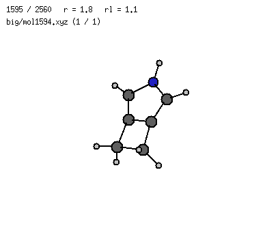
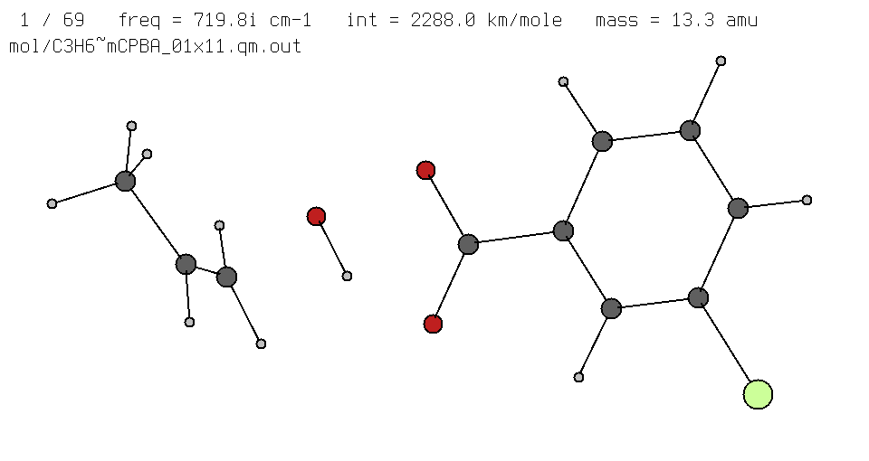
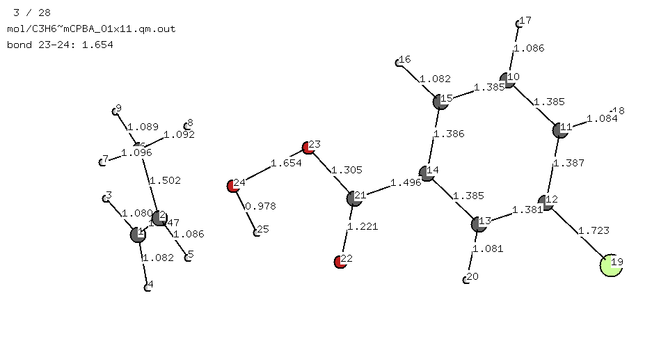
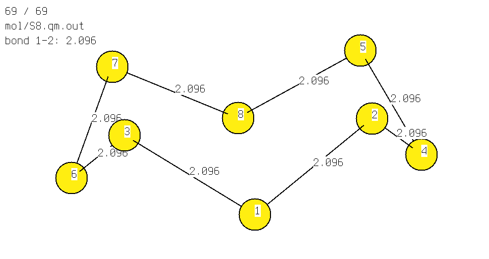
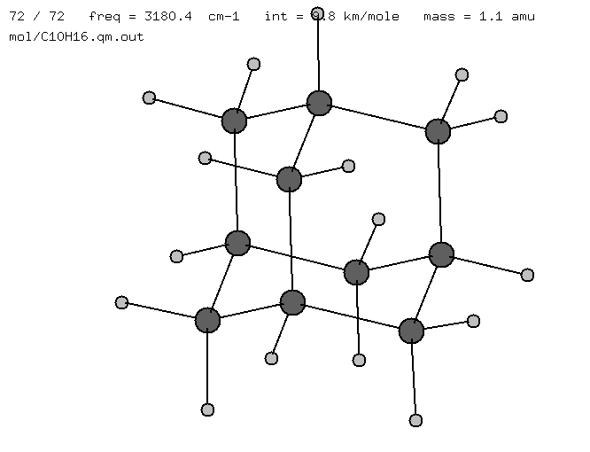
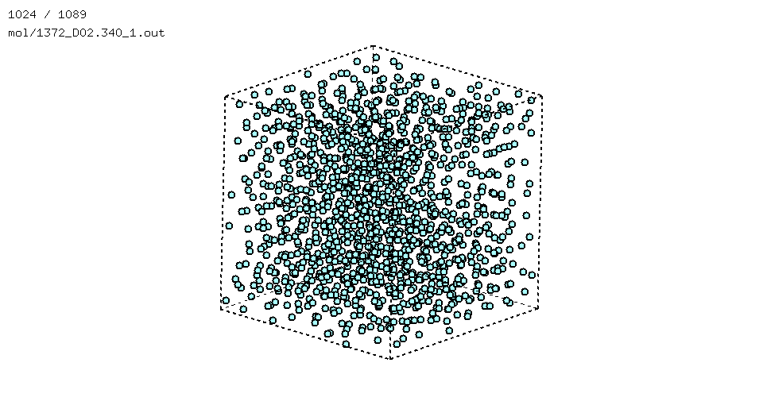
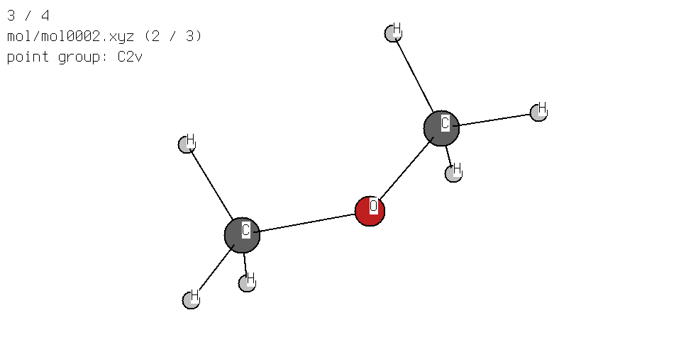
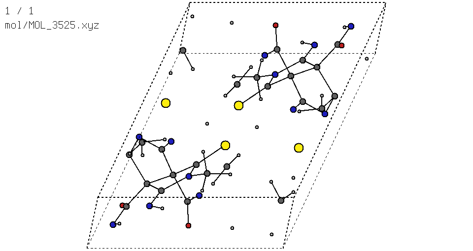
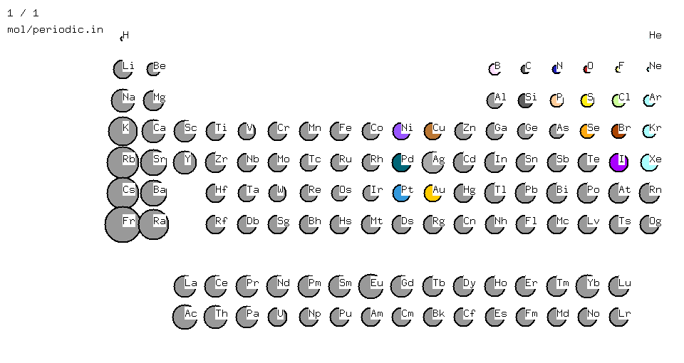

# v

A simple X11 molecular viewer.



---

## Supported formats
- [Priroda](http://rad.chem.msu.ru/~laikov) input and output files
- [`.xyz`](https://en.wikipedia.org/wiki/XYZ_file_format) files
- [extended `.xyz`](https://github.com/libAtoms/extxyz) files (currently the extra columns are ignored)
- various quantum-chemical outputs with [`cclib`](https://github.com/cclib/cclib), see the Python wrapper [page](python/README.md).


## Python package (wrapper / API) available

See python package page
[here.](python/README.md)

Provides wrapper scripts with a simple installation and
allows to open unsupported file formats with `cclib`.

## Download [↑](#download)
```bash
# uncomment your OS:
#OS=Linux
#OS=macOS
wget https://github.com/briling/v/releases/latest/download/v.${OS}.exe --output-document=./v
chmod +x ./v
```

## Build [↑](#contents)

See build [instructions](BUILD.md).

### Requirements:

* `GNU/Linux` / `Cygwin` / `macOS`
* `X11` / `XQuartz`

## Usage [↑](#contents)
```
./v file [file2 ... fileN] [options]
```
A filename `-` stands for the standard input (xyz files only).

Show the reference:
```
./v
```

### Options
<details open><summary><strong>Command-line options</strong></summary>

|                          |                                                               |
| ------------------------ | ------------------------------------------------------------- |
| `vib:%d`                 |     force to show geometries (`0`) / vibrations (`1`)         |
| `bonds:0`                |     disable bonds                                             |
| `bohr:1`                 |     assume input files are in Bohr (default is Å)             |
| `dt:%lf`                 |     delay between frames in seconds (default 0.02)            |
| `symtol:%lf`             |     tolerance for symmetry determination in Å (default 0.001) |
| `bmax:%lf`               |     max. length of a bond to display                          |
| `z:%d,%d,%d,%d,%d`       |     show an internal coordinate (`1,i,j,0,0` — distance i-j; `2,i,j,k,0` — angle i-j-k; `3,i,j,k,l` — torsion i-j-k-l) |
| `rot:%lf,%lf,%lf,%lf,%lf,%lf,%lf,%lf,%lf`   | rotation matrix to start with (default identity matrix)  |
| `frame:%d`               |     frame to start with (default 1)                                         |
| `font:%s`                |     font ([xlfd](https://en.wikipedia.org/wiki/X_logical_font_description)) |
| `colors:%s`              |      colorscheme (`v` (default) or `cpk`)                                   |
| `cell:b%lf,%lf,%lf`                         | cuboid size in a.u. (for periodical boundary conditions) |
| `cell:%lf,%lf,%lf`                          | cuboid size in Å                                         |
| `cell:b%lf,%lf,%lf,%lf,%lf,%lf,%lf,%lf,%lf` | cell parameters in a.u.                                  |
| `cell:%lf,%lf,%lf,%lf,%lf,%lf,%lf,%lf,%lf`  | cell parameters in Å                                     |
| `shell:b%lf,%lf`                            | spheres radii in a.u.                                    |
| `shell:%lf,%lf`                             | spheres radii in Å                                       |
| `cell:0`                                    | disable PBC from the extended xyz file header            |
| `cell:b%%lf[,%%lf,%%lf[,%%lf,%%lf,%%lf,%%lf,%%lf,%%lf]]` | cubic / orthogonal / non-orhogonal cell parameters in a.u. |
| `cell:%%lf[,%%lf,%%lf[,%%lf,%%lf,%%lf,%%lf,%%lf,%%lf]]`  | cubic / orthogonal / non-orhogonal cell parameters in Å |
| `shell:b%%lf[,%%lf]                         | sphere(s) radii in a.u.                                  |
| `shell:%%lf[,%%lf]                          | sphere(s) radii in Å                                     |
| `center:%d`                                 | origin is geometric center (`1`, default) / center of mass (`2`) / as is (`0`) |
| `inertia:%d`                                | if rotate molecules wrt axis of inertia (`1`) or not (`0`, default) |
| `gui:%d`                                    | gui (default `1`) / headless (`0`) mode               |
| `com:%s`                                    | command sequence for `gui:0`                             |
| `exitcom:%s`                                | command sequence to run on exit (same as for `gui:0`)    |
| `startcom:%s`                               | command sequence to run on startup                       |


</details>

### Keyboard
<details open><summary><strong>Keyboard reference</strong></summary>

|                                |                                                           |
| ------------------------------ |---------------------------------------------------------- |
| `←`/`↑`/`→`/`↓`/`pgup`/`pgdn`  |  rotate (slower with `ctrl` or `shift`)
| `w`/`a`/`s`/`d` or `↑`/`←`/`↓`/`→` on numpad |  move   (slower with `ctrl` or `shift`)
|                                |
| `0`                            |  go to the first point
| `=`                            |  go to the last point
| `enter`/`backspace`            |  next/previous point
| `ins`                          |  play forwards  / stop (vibration mode: animate selected normal mode / stop)
| `del`                          |  play backwards / stop
|                                |
| `home`/`end`                   |  zoom in/out
| `1`/`2`                        |  scale bond lengths
| `3`/`4`                        |  scale atom sizes
|                                |
| `.`                            |  show point group
|                                |
| `n`                            |  show/hide atom numbers
| `t`                            |  show/hide atom types
| `l`                            |  show/hide bond lengths
| `b`                            |  show/hide bonds
|                                |
| `tab`                          |  read new points
| `r`                            |  reread file
| `x`                            |  print molecule (Priroda input + bonds)
| `z`                            |  print molecule (`.xyz`)
| `p`                            |  print molecule (input for an `.svg` generator)
| `u`                            |  print the current rotation matrix
| `m`                            |  save the current frame ([`.xpm`](https://en.wikipedia.org/wiki/X_PixMap) format)
| `f`                            |  save all frames starting from the current one (vibration mode: save all frames to animate the selected normal mode)
|                                |
| `j`                            |  jump to a frame (will be prompted): `enter` to confirm, `esc` to cancel
|                                |
| `q` / `esc`                    |  quit

</details>

### Mouse

One can also use the mouse to rotate the molecule and zoom in/out.

### Additional commands

#### Headless mode

If run in the headless mode with `gui:0`, the symbols from the standard input are processed
as if the corresponding keys were pressed in the gui mode.
Right now, `p`, `x`, `z`, `u`, and `.` are available.
Command-line option `com:%s` overrides the standard input.
These examples are equivalent:
```
> echo . | ./v mol/mol0001.xyz gui:0
D*h

> ./v mol/mol0001.xyz gui:0 com:.
D*h

> cat mol/mol0001.xyz | ./v - gui:0 com:.
D*h
```

#### GUI mode
In the GUI mode, the symbols from the CLI option `exitcom:` are executed immediately before closing.
For example,
```
./v mol/mol0001.xyz exitcom:z
```
automatically prints the last xyz coordinates when the user closes the window.

The symbols from the CLI option `startcom:` are executed before the main loop.
For example,
```
./v mol/mol0001.xyz startcom:aaaaaaa
```
moves the molecule to the left, and
```
./v mol/mol0001.xyz startcom:.mq
```
opens the file, computes the point group, save a picture to `mol/mol0001.xyz_1.xpm` and closes the window.
For other examples, see [fig/regenerate.bash](fig/regenerate.bash) for the commands used to generate the figures on this page.


<details><summary><strong>Click to see currently available commands</strong></summary>


| CLI regime symbol  | GUI keyboard command  |                   | GUI (`exitcom:`/`startcom:`) | headless (`com`) |
| ------------------ | --------------------- | ----------------- | ---------------------------- | ---------------- |
| `w`/`a`/`s`/`d`    | `w`/`a`/`s`/`d`       | move              | +                            | + (PBC)          |
| `+` / `-`          | `home`/`end`          | zoom              | +                            |                  |
| `>`                | `ins`                 | animate           | +                            |                  |
| `3`/`4`            | `3`/`4`               | scale atom sizes  | +                            |                  |
| `n`/`t`/`l`        | `n`/`t`/`l`           | toggle atom view  | +                            |                  |
| `m`/`f`            | `m`/`f`               | saving frame(s)   | +                            |                  |
| `q`                | `q`                   | quit              | +                            |                  |
| `1`/`2`            | `1`/`2`               | scale bonds       | +                            | +                |
| `b`/`l`            | `b`/`l`               | toggle bond view  | +                            | +                |
| `.`                | `.`                   | point group       | +                            | +                |
| `x`,`z`,`p`,`u`    | `x`,`z`,`p`,`u`       | printing          | +                            | +                |


</details>


> [!NOTE]
> The size depends on my screen and window layout, you might need to adjust the number of move/zoom in commands or the window size.

> [!WARNING]
> Currently this option is unstable. Please let me know if you encounter any problems.

### Boundary conditions
Two types of boundary conditions are recognized:
* PBC (3D)
* spherical confinement

#### PBC
PBC can be read from the xyz [file header](https://ase-lib.org/ase/io/formatoptions.html#extxyz)
by specifying `Lattice="ax ay az bx by bz cx cy cz"`:
```
./v mol/MOL_3525.ext.xyz
```
Currently, only the PBC in all three dimensions are supported.
Every molecule can have its own lattice:
```
./v mol/MOL_3525.ext.xyz mol/Si8.extended.xyz
```

The lattice can be passed via the command-line, in which case it overrides the one from the file
and applies to all the molecules:
```
./v mol/MOL_3525.xyz cell:8.929542,0,0,4.197206,8.892922,0,0.480945,2.324788,10.016044
```
For orthogonal/cubic cell:
```
./v mol/1372_D02.340_1.out bonds:0 cell:20.23,20.23,20.23
./v mol/1372_D02.340_1.out bonds:0 cell:20.23
```
In Bohr instead of Å:
```
./v mol/1372_D02.340_1.out bonds:0 cell:b10.7
```
Finally, to disable the cell from the file:
```
./v mol/MOL_3525.ext.xyz cell:0
```

#### Spherical confinement
Spherical confinement can be specified from the command-line by the following:
```
./v mol/mol0001.xyz shell:2     #  sphere with r = 2 Å is put around the molecule
./v mol/mol0001.xyz shell:b4    #  sphere with r = 2 Bohr
./v mol/mol0001.xyz shell:2,3   #  spheres with r = 2 and 3 Å (e.g., soft and hard boundaries)
./v mol/mol0001.xyz shell:b4,5  #  spheres with r = 4 and 5 Bohr
```

</details>


## Examples [↑](#contents)
* `mol/C3H6~mCPBA_01x11.qm.out` — geometries + vibrations
```
./v mol/C3H6~mCPBA_01x11.qm.out 
```

```
./v mol/C3H6~mCPBA_01x11.qm.out vib:0 z:1,23,24,0,0
```

* `mol/S8.qm.out`     — geometries
```
./v mol/S8.qm.out z:1,1,2,0,0 
```

* `mol/C10H16.qm.out` — vibrations
```
./v mol/C10H16.qm.out 
```

* `mol/1372_D02.340_1.out` — PBC simulation
```
./v mol/1372_D02.340_1.out bonds:0 cell:b10.7 
```

* `mol/mol0001.xyz`, `mol/mol0002.xyz` — `.xyz` files with atomic numbers and atomic symbols
```
./v mol/mol0001.xyz mol/mol0002.xyz symtol:1e-2 
```


* `mol/MOL_3525.xyz` — organic crystal with non-orthogonal cell
```
./v mol/MOL_3525.ext.xyz
```
```
./v mol/MOL_3525.xyz cell:8.929542,0.0,0.0,4.197206,8.892922,0.0,0.480945,2.324788,10.016044 
```


* Currently two colorschemes are supported 
  (thanks to [@iribirii](https://github.com/iribirii))
```
v mol/periodic.in bonds:0 colors:v    # default
v mol/periodic.in bonds:0 colors:cpk
```


---

The figures are generated with
```
fig/regenerate.bash
```
